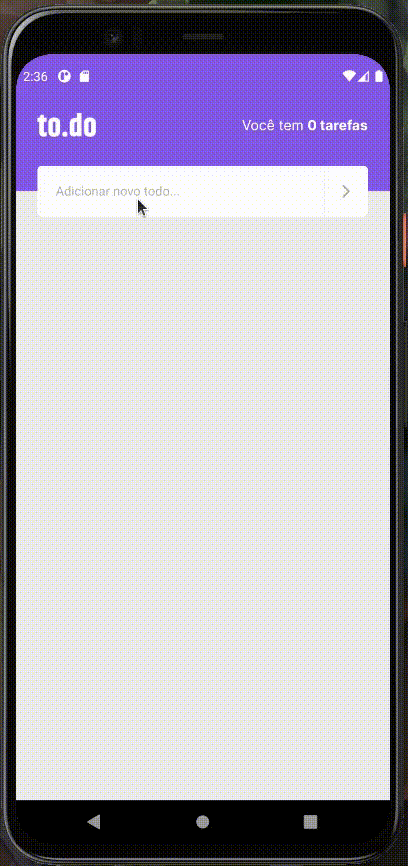

# 💻 Sobre o desafio

Nesse desafio, você deverá criar uma aplicação para treinar o que aprendeu até agora no React Native.

Essa será uma continuação da aplicação de lembrete de tarefas desenvolvida no desafio anterior, onde você vai treinar um pouco mais sobre propriedades e componentização no React.
As funcionalidades do aplicativo são:

- Edição de uma tarefa;
- Exibir alerta pedindo confirmação ao remover uma tarefa;
- Exibir alerta ao tentar adicionar tarefa com o mesmo nome.

## Template e Figma da aplicação

Para te ajudar nesse desafio, deixaremos para você o Figma da aplicação (selecione no canto superior esquerdo  `Pages -> Complementar`):

[to.do](https://www.figma.com/file/L442P4syOkbHGaLr4fGad4/to.do/duplicate)

<aside>
⚠️ Alerta: Caso ao clicar no link você se depare com o erro que `WebGL` não está ativado no seu navegador, <a href="https://help.figma.com/hc/en-us/articles/360039828614#Enable_WebGL">siga esses passos</a>.

</aside>

Em relação ao template, utilize como base a solução desenvolvida por você no desafio anterior.

## Como deve ficar a aplicação ao final?

Está com dúvidas (ou curioso 👀) para ver como deve ficar a aplicação ao final do desafio? Deixamos abaixo um vídeo mostrando as principais funcionalidades que você deve implementar para te ajudar (ou matar sua curiosidade 👀).

## O que devo editar na aplicação?

Como esse desafio não possui um template nem testes, você tem maior liberdade para realizar as alterações onde preferir, desde que implementem as funcionalidades pedidas. Nesse desafio, **sugerimos** que você edite os seguintes arquivos:

- src/pages/Home.tsx.
- src/components/TasksList.tsx;
- src/components/TaskItem.tsx (criar esse arquivo);

Abaixo você vai ter duas formas de seguir o desafio:

1. Um guia do que você deve editar por arquivo (mais difícil);
2. Um guia do que você deve editar para implementar uma funcionalidade (mais fácil);

Então escolha o que preferir e bora pro desafio 🚀

[Guia por arquivo](porArquivo.md)

[Guia por funcionalidade](porFuncionalidade.md)

# Dicas do desafio

Se você leu a nossa doc e viu nosso vídeo de introdução, mas mesmo assim se sente travado na hora de resolver, que tal dar uma olhada nas dicas abaixo para te ajudar a resolver o desafio (com poucos spoilers, prometo 😉):

[https://www.youtube.com/watch?v=7Q27hyC9LBU](https://www.youtube.com/watch?v=7Q27hyC9LBU)

# Solução do desafio

Caso você queira ver como resolver o desafio, fizemos um vídeo explicando o passo a passo para cumprir com todos os requisitos da aplicação:

[https://www.youtube.com/watch?v=quMNpCjy_rc](https://www.youtube.com/watch?v=quMNpCjy_rc)

# 📅 Entrega

Esse desafio deve ser entregue a partir da plataforma da Rocketseat. Envie o link do repositório que você fez suas alterações. Após concluir o desafio, além de ter mandado o código para o GitHub, fazer um post no LinkedIn é uma boa forma de demonstrar seus conhecimentos e esforços para evoluir na sua carreira para oportunidades futuras.

Feito com 💜 por Rocketseat 👋 Participe da nossa [comunidade aberta!](https://discord.gg/Ns86RQyVH8)